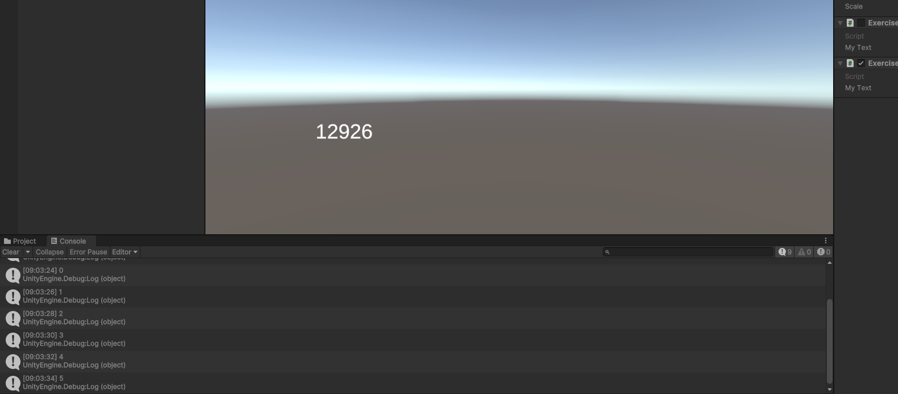

# Exercise 3:

In theory in this exercise we eill get answers for last exercise's questions.

First I must put this code in the raspberry:

        void task()
        {
                enum class TaskStates
                {
                        INIT,
                        WAIT_INIT,
                        SEND_EVENT
                };
                static TaskStates taskState = TaskStates::INIT;
                static uint32_t previous = 0;
                static u_int32_t counter = 0;

                switch (taskState)
                {
                        case TaskStates::INIT:
                        {
                                Serial.begin(115200);
                                taskState = TaskStates::WAIT_INIT;
                                break;
                        }
                        case TaskStates::WAIT_INIT:
                        {
                                if (Serial.available() > 0)
                                {
                                        if (Serial.read() == '1')
                                        {
                                                previous = 0; // Force to send the first value immediately
                                                taskState = TaskStates::SEND_EVENT;
                                        }
                                }
                                break;
                        }
                        case TaskStates::SEND_EVENT:
                        {
                                uint32_t current = millis();
                                if ((current - previous) > 2000)
                                {
                                        previous = current;
                                        Serial.print(counter);
                                        counter++;
                                }
                                if (Serial.available() > 0)
                                {
                                    if (Serial.read() == '2')
                                    {
                                            taskState = TaskStates::WAIT_INIT;
                                    }
                                }
                                break;
                        }
                        default:
                        {
                                break;
                        }
                }
        }

        void setup()
        {
                task();
        }

        void loop()
        {
                task();
        }

And this code in unity:

        using UnityEngine;
        using System.IO.Ports;
        using TMPro;

        enum TaskState
        {
            INIT,
            WAIT_START,
            WAIT_EVENTS
        }

        public class Serial : MonoBehaviour
        {
                private static TaskState taskState = TaskState.INIT;
                private SerialPort _serialPort;
                private byte[] buffer;
                public TextMeshProUGUI myText;
                private int counter = 0;

                void Start()
            {
                _serialPort =new SerialPort();
                _serialPort.PortName = "COM3";
                _serialPort.BaudRate = 115200;
                _serialPort.DtrEnable =true;
                _serialPort.Open();
                Debug.Log("Open Serial Port");
                buffer =new byte[128];
            }

        void Update()
            {
                myText.text = counter.ToString();
                counter++;

                        switch (taskState)
                {
                                case TaskState.INIT:
                            taskState = TaskState.WAIT_START;
                        Debug.Log("WAIT START");
                                        break;
                                case TaskState.WAIT_START:
                                        if (Input.GetKeyDown(KeyCode.A))
                        {
                            byte[] data = {0x31};// start
                            _serialPort.Write(data,0,1);
                            Debug.Log("WAIT EVENTS");
                            taskState = TaskState.WAIT_EVENTS;
                        }
                                        break;
                                case TaskState.WAIT_EVENTS:
                                        if (Input.GetKeyDown(KeyCode.B))
                        {
                            byte[] data = {0x32};// stop
                            _serialPort.Write(data,0,1);
                            Debug.Log("WAIT START");
                            taskState = TaskState.WAIT_START;
                        }
                                        if (_serialPort.BytesToRead > 0)
                        {
                            int numData = _serialPort.Read(buffer, 0, 128);
                            Debug.Log(System.Text.Encoding.ASCII.GetString(buffer));
                        }
                                        break;
                                default:
                        Debug.Log("State Error");
                                        break;
                }
            }
        }

This code it's supposed to start counting in the debug whenever A is pressed

It is working fine